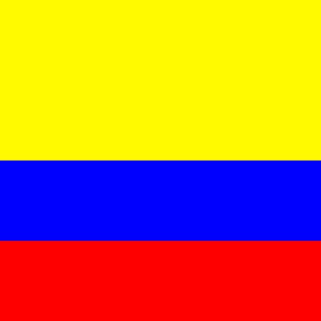

# Estructura de un juego en pygame

## Inicializacion

como en todo programa en python, se deben importar los modulos o librerias a utilizar.

`import pygame`

- inicializar pygame usando la funcion init(). Inicializa todos los modulos de pygame importados.

``pygame.init()``

## Visualizacion de la ventana

``ventana= pygame.display.set_mode((600,400))``

- set_mode es la funcon encargada de definir el tamaño de la ventana. En el ejemplo se esta definiendo una ventana de 600 pixeles de ancho y 400 pixeles de largo

`pygame.display.set_caption("Mi ventana")`

- set_caption() es la funcion que añade un titulo a la ventana.

### funcion set_mode()

`set_mode(size =(0,0), flags ) = 0, depth = o, display = 0)`

- size = (600,400) : define el tamaño de la ventana
- flags = define uno o mas comportamientos para la ventana

    - Valores:
        - pygame.FULLSCREEN
        - pygame.RESIZABLE
    - Ejemplo:
        - flags = pygame.FULLSCREEN | pygame.RESIZABLE: pantalla completa, dimensiones modificables.

## Bucle del juego - game loop

- Bucle infinito que se interrumpira al cumplir ciertos criterios
- Reloj interno de juego
- En cada iteracion del bucle del juego podemos mover a un personaje, o tener en cuenta que un objeto a alcanzado
a otro, o que se ha cruzado la linea de llegada, lo que quiere decir que la partida ha terminado
- Cada iteracion es una oportunidad para actualizar todo los datos relacionados con el estado actual de la
partida o del juego
- En cada iteracion se realiza las siguentes tareas:
    1. Comprobar que no se alcanzan las condiciones de parada, en cuyo caso se interrumpe el bucle.
    2. Actualizar los recursos necesarios para la iteracion actual.
    3. Obtener las entradas del sistema, o de interaccion con el jugador.
    4. Actualizar todas las entidades que caracterizan el juego
    5. Refrescar la pantalla

## Superficies pygame

- Superficie: 
    - Elemento geometrico
    - Linea, poligono, imagen, texto que se muestra en la pantalla
    - El poligono se puede o no rellenar de color
    - Las Superficie se crea de diferente manera dependiendo del tipo:
        - imagen: image.load()
        - texto: font.render()
        - Superficie generica: pygame.surface
        - Ventana del juego: pygame.display.set_mode() 


# Ejemplo Bandera de Colombia

```Python
# Importamos la libreria pygame
import pygame
import random

# Inicializamos los modulos de pygame
pygame.init()

# Establecer titulo a la ventana
pygame.display.set_caption("COLORES")

# Establecemos las dimensiones de la ventana
ventana = pygame.display.set_mode((400,400))

# Definimos un color
amarrillo = (255,250,0)
azul =  (0,0,255)
rojo =  (255,0,0)


# Crear una superficie
color_amarrillo = pygame.Surface((400, 200))
color_azul = pygame.Surface((400, 300))
color_rojo = pygame.Surface((400, 100))


# Rellenamos la superficie de amarrillo azul y rojo
color_amarrillo.fill((amarrillo))
color_azul.fill((azul))
color_rojo.fill((rojo))

# Inserto o muevo la superficie en la ventana
ventana.blit(color_amarrillo, (0, 0))
ventana.blit(color_azul, (0, 200))
ventana.blit(color_rojo, (0, 300))

# Actualiza la visualizacion de la ventana
pygame.display.flip()

# Bucle del juego
while True:
    event = pygame.event.wait()
    if event.type == pygame.QUIT:
        break 

pygame.quit()
```



## Gestion de tiempo y los eventos

### Modulo Time

- este modulo ofrece varias funciones que permiten cronometrar la secion actual (desde el init) o pausar la ejecucion, por ejemplo:
- Funciones:
    - pygame.time.get_ticks
    - pygame.time.waitpygame.time.delay

- Objeto Clock
    - la funcion tick permite actualizar el reloj asociado con el juego actual. 
    -se llama cada vez que se actualiza la pantalla de juego.
    - permite especificar el numero maximo de fps y por tanto, limitar y controlar la veocidad del juego
    - Si insertamos en un bucle de juego la siguente linea, garantizamos que nunca se ira mas rapido de 50
    fotogramas por segundo: `Clock.tick(50)`

### Gestion de eventos

- Hay diferentes formas para que el programa sepa que se ha desencadenado un evento.
- Es esencial que los programas puedan conocer inmediatamente las acciones del jugador a travez del teclado 
el mouse un joystick o cualquier otro  periferico

#### Funcion pygame.event.get

- Permite obtener todo los eventos en espera de ser procesados y que estan disponibles en una cola.
- Si no hay ninguno, Entonces se obtiene una coleccion vacia.
```Python
# Usamos un bucle for para recorrer todos los eventos de la coleccion obtenida para tener la opcion get
for event in pygame.event.get():
    if event.type == pygame.KEYDOWN
        if event.key == pygame.K_ESCAPE:
            PARAR_JUEGO = True
```

#### Funcion pygame.event.wait

- Esta funcion espera a que ocurra un evento, y en cuanto sucede, esta disponible

```Python
while True:
    event = pygame.event.wait()
    if event.type == pygame.QUIT:
        break 
```

#### Funcion pygame.event.poll

- Devuelve solo uno de los eventos en la cola de espera


## Sonidos en pygame

- pygame.mixer: Modulo que permite la gestion del sonido.
- music: Modulo que gestiona la musica de fondo. Necesiaramente solo hay uno a la vez
- Sound: Objeto del modulo mixer que se puede instaciar varias veces para usarlo en efectos de sonido
del juego

### Archivos de sonido
- Se recomienda usar dos formatos principalmente:
    - Formato WAV (Wave Audio File Format)
    - Formato abierto y gratuito OGG

### Channe (Canal) en pygame
- Un juego tiene varios canales de sonido.
- Se puede asignar un sonido al canal numero uno y otro diferente al numero 2
- Entonces es posible reproducir sonidos simultaneamente activando la lectura en diferentes canales

## Sprites
- Objeto que asocia una ubicacion, Una representacion grafica (Esta o aquella imagen, por ejemplo) y un
conjunto de propiedades
- Estas propiedades pueden ser un nombre, un texto, valores booleanos que caracterizan el objeto en cuestion
(Por ejemplo si el objeto se puede mover o no)
- Una posible traduccion del termito sprite podria ser "imagen-objeto" que se actualiza con cada iteracion del
bucle del juego
- Cuanto mas complejo el juego, mas objetos graficos tiene que gestionar y actualizar, lo que puede ser tedioso
- pygame usa no solo la nocion sprite, si no la nocion de grupos de sprites (group)
- La nocion de group permite agrupar los objetos del mismo tipo. Ejemplo: Todos los soldados de un ejercito,
lo que se entiende como una coleccion de instancias de una clase soldado.
- Un determinado procesamiento se puede aplicar a un conjunto o a un subconjunto de sprites. Ejemplo: Cambiar
el color de todos los enemigos o hacer invisibles algunos objetos.


